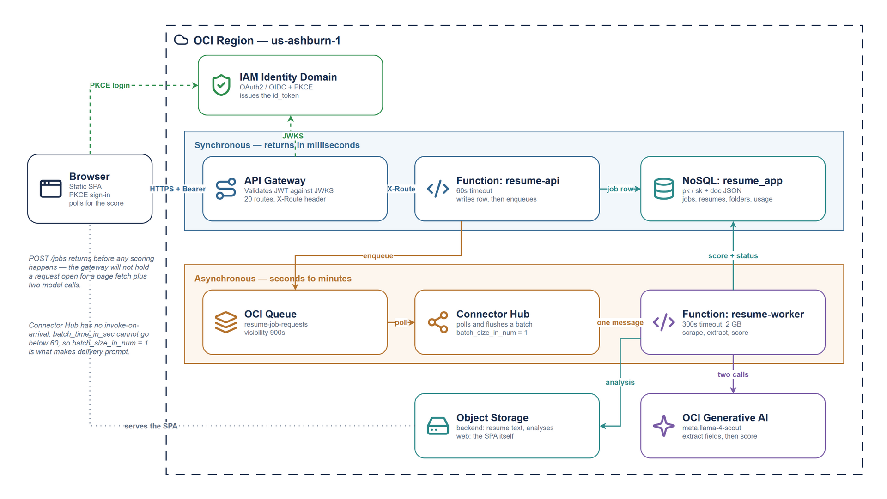

# OCI Resume Scoring — Asynchronous AI with OCI Generative AI

This project delivers a fully automated **AI resume scoring application** on OCI,
built with **OCI API Gateway**, **OCI Functions**, **OCI NoSQL Database**, **OCI
Queue**, **Connector Hub**, and **OCI Generative AI**, and secured with **OCI IAM
Identity Domains** (OAuth2 / OIDC, Authorization Code + PKCE).

Users upload one or more resumes, then submit job postings — either a URL or
pasted text. The app scrapes the posting, asks a large language model to extract
the structured job description, then scores the resume against it from 0 to 100
with a written analysis of strengths and gaps.

This is the OCI member of a four-cloud set alongside **aws-resume-app**,
**gcp-resume-app** and the Azure build. The workload is identical in all four;
only the plumbing differs.



## Why this is asynchronous

Scoring is not done inline, and that is not a design preference.

A page fetch plus two model calls takes far longer than **API Gateway will hold a
request open**. The synchronous version of this endpoint cannot exist — on any of
the four clouds. So `POST /jobs` writes the job row, snapshots the resume, drops
a message on a queue and returns immediately with `submitted`. A separate worker
drains the queue, does the slow work, and writes the score back. The browser
polls until the status changes.

Every cloud in this set solves that the same way and names it differently:

| Cloud | Queue | Bridge to compute |
|---|---|---|
| AWS | SQS | Lambda event source mapping |
| GCP | Pub/Sub | Eventarc |
| Azure | Service Bus | Functions trigger |
| **OCI** | **Queue** | **Connector Hub** |

OCI is the outlier, and it is worth knowing why. Connector Hub has **no
invoke-on-arrival semantic**. It polls the queue and flushes a batch when either
a size or a time threshold is reached, and the timer starts with the first
message of the batch. `batch_time_in_sec` cannot be set below 60 — so at the
default batch size a single submitted job waits the **full minute** before the
worker ever sees it. Setting `batch_size_in_num = 1` is what makes delivery
prompt (1–2 seconds). Leaving those at their defaults is the most common way to
conclude the pipeline is broken when it is merely batching.

## Key capabilities demonstrated

1. **Asynchronous AI pipeline** – Queue plus Connector Hub decouples a slow
   inference workload from a request/response API that could never contain it.
2. **OCI Generative AI** – On-demand inference against Meta Llama 4, with
   per-user token accounting and a lifetime cap enforced before work is accepted.
3. **Serverless compute** – Two OCI Functions from one container image, selected
   by an environment variable: a short-timeout API function and a long-timeout
   worker.
4. **Managed NoSQL storage** – A single table with a composite key and a JSON
   payload column holding four different entity types.
5. **Authenticated per-user isolation** – API Gateway validates the caller's JWT
   against the identity domain's JWKS; the verified `sub` claim is the NoSQL
   shard key, so users only ever see their own data.
6. **Infrastructure as Code** – Terraform provisions everything across four
   phases, repeatably and auditably.

## Architecture

```
Browser (SPA on Object Storage)
   │  PKCE login → Identity Domain → id_token
   ▼
API Gateway — resume-gateway
   │  JWT_AUTHENTICATION against the domain JWKS
   │  injects X-Route + path params; forwards Authorization
   ▼
Function: resume-api (60s)
   │  POST /jobs → snapshot resume → enqueue → return "submitted"
   ▼
OCI Queue → Connector Hub (batch_size_in_num = 1)
   ▼
Function: resume-worker (300s, 2 GB)
   │  scrape posting → Gen AI extract fields → Gen AI score
   ▼
NoSQL (score + status)      Object Storage (analysis, snapshots, attachments)
```

## API Gateway Endpoints

All twenty routes are backed by a single Function that dispatches internally.
Every route requires a valid `Authorization: Bearer <id_token>` header; the
gateway rejects unauthenticated calls before any function runs.

| Method | Path | Purpose |
|---|---|---|
| POST | `/register` | Idempotent first-sign-in record; enforces the user cap |
| GET | `/usage` | Token consumption and limit for the usage ring |
| GET | `/folders` | List folders |
| POST | `/folders` | Create a folder |
| DELETE | `/folders/{folder_id}` | Delete a folder; jobs survive, grouping is cleared |
| GET | `/jobs` | List jobs with status, score and attachment count |
| POST | `/jobs` | Submit a job for scoring (returns immediately) |
| GET | `/jobs/{job_id}` | Job metadata plus all stored text artifacts |
| DELETE | `/jobs/{job_id}` | Delete the job and every object under its prefix |
| PATCH | `/jobs/{job_id}/notes` | Update notes (the only mutable field) |
| PATCH | `/jobs/{job_id}/folder` | Move a job into or out of a folder |
| GET | `/jobs/{job_id}/attachments` | List attachments |
| POST | `/jobs/{job_id}/attachments` | Upload an attachment (base64 JSON, 10 MB) |
| GET | `/jobs/{job_id}/attachments/{attachment_id}` | Download an attachment |
| DELETE | `/jobs/{job_id}/attachments/{attachment_id}` | Delete an attachment |
| GET | `/resumes` | List resumes |
| POST | `/resumes` | Create a resume |
| GET | `/resumes/{resume_id}` | Retrieve a resume with full text |
| PUT | `/resumes/{resume_id}` | Replace a resume |
| DELETE | `/resumes/{resume_id}` | Delete a resume and its stored text |

## Choosing the model

Model selection lives in **`genai-config.sh`**, the single source of truth shared
by the deploy scripts and Terraform. The default is
**`meta.llama-4-scout-17b-16e-instruct`**.

That choice is deliberate. OCI retires on-demand models aggressively — as of
August 2026 in `us-ashburn-1` every Cohere chat model is already retired, the
entire Grok 3/4 line retired on a single day, and there is no Anthropic model at
all. Google Gemini is available, but Gemini 2.5 is retiring upstream. Meta's
Llama 4 entries carry no retirement date and have open weights behind them.

`check_env.sh` refuses to deploy if the configured model is not currently served
on demand, so a retirement surfaces as a clear pre-flight error rather than every
job silently failing later.

To see what is live in your tenancy:

```bash
T=$(grep -m1 '^tenancy' ~/.oci/config | cut -d= -f2 | tr -d ' ')
oci generative-ai model-collection list-models --compartment-id "$T" --output json \
 | jq -r '.data.items[]
          | select(.capabilities[]? == "CHAT")
          | select(."time-on-demand-retired" == null)
          | "\(.vendor)  \(."display-name")"' | sort -u
```

## Prerequisites

- `oci`, `terraform`, `docker`, `jq`, `envsubst` in PATH
- OCI CLI configured (`~/.oci/config`, API key)
- Permission to **create identity domains** and **Identity Domain Administrator**
  on the new domain — `setup_domain.sh` creates the domain and talks to its SCIM
  API
- OCI Generative AI available in your region (Ashburn is fine; `check_env.sh`
  verifies the specific model)

No console clicks are required. `setup_domain.sh` builds the domain, enables the
signing certificate so API Gateway can read the JWKS, and creates the
self-registration profile. End users create their own logins.

## Deployment

```bash
./apply.sh      # check_env → setup_domain → 01-ocir → 02-docker → 03-functions → 04-webapp
./validate.sh   # asserts auth is enforced and the async tier is actually live
```

`apply.sh` reads the Phase 3 outputs, renders `04-webapp/js/config.js` from its
template, and uploads the SPA.

`validate.sh` checks something the API surface cannot show you: that the queue
and connector are both `ACTIVE`. Without a live connector, `POST /jobs` still
returns 200 and the job row still appears — it simply never leaves `submitted`.

## Teardown

```bash
./destroy.sh          # 1. purge the backend bucket, remove Terraform resources
./delete_domain.sh    # 2. deactivate + delete the domain, remove env.sh
```

Run them in that order. `destroy.sh` empties the backend bucket first — the
functions fill it at runtime with objects Terraform knows nothing about, and
Object Storage refuses to delete a non-empty bucket.

External User domains bill per monthly active user, so run `delete_domain.sh`
when you are finished with the demo.

## Notes and gotchas

- **Resource Principal propagation.** A Function container caches its dynamic
  group membership at boot. A container that started before the DG or its
  policies propagated keeps a groupless token and returns 404
  `NotAuthorizedOrNotFound` for its entire life, while one started later works.
  The OCI SDK treats that 404 as *transient* and retries it, so the first calls
  hang for the full function timeout and later ones fail instantly once the
  circuit breaker opens — one fault presenting as two different bugs. Recycle
  the container rather than editing the policy.
- **The SPA is not served from a domain root.** Object Storage hosts it under
  `/n/<namespace>/b/<bucket>/o/`, so `window.location.origin` silently drops the
  path. Every browser-side URL derives from `CONFIG.WEB_BASE_URL`, and asset
  references are relative.
- **HTTPS is required**, not merely advisable: PKCE uses `crypto.subtle`, which
  is undefined outside a secure context.
- **Identity Domains rotates refresh tokens**, unlike Cognito, so the new one has
  to be stored or the next refresh fails.
- **Editing a resume does not rescore past jobs.** Each job snapshots the resume
  text it was scored against, so historical scores stay reproducible.

## Licensing

The application code in this repository is provided as a reference
implementation. OCI Generative AI usage is billed per token; the per-user
lifetime cap in `users.py` exists so a public demo cannot run away with it.
